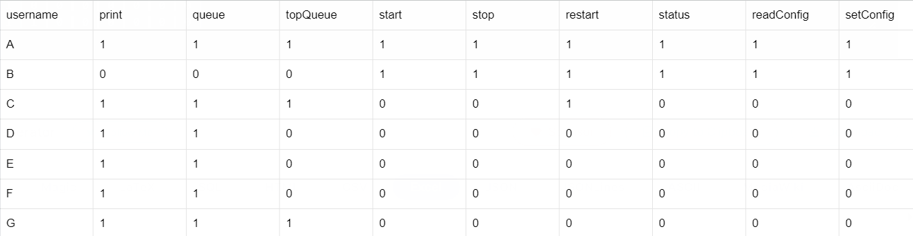

# Access Control Lab

> Group: 19
>
> - s233509: Giancarlo Andriano
> - s233508: Jawad Zaheer
> - s233511: Songlin Jiang

## Introduction

<!-- > (max 1 page)
> The introduction should provide a general introduction to the problem of access control in client/server applications. It should define the scope of the answer, i.e. explicitly state what problems are considered, and outline the proposed solution. Finally, it should clearly state which of the identified goals are met by the developed software. -->

Access control is a critical component in managing information security within any client/server system. It ensures that only authorized users can access specific resources, maintaining the integrity and confidentiality of sensitive data. Effective access control is pivotal in environments where information security is paramount.

The two primary access control models are Access Control Lists (ACL) and Role-Based Access Control (RBAC). ACLs are focused on individual users, granting specific permissions to each user for various operations. In contrast, RBAC assigns permissions based on user roles within the organization, streamlining the management of user privileges based on their job functions or responsibilities.

For the purpose of this AC lab, the goal is to achieve the following properties:

- Integrate both ACL and RBAC methodologies, making it possible to switch between the two.
- External management of ACL parameters.
- Apply changes in organizational roles and responsibilities, ensuring ongoing relevance and effectiveness.
- Test software functionalities and correctness.

## Access Control Lists

<!-- > (max 2 pages)
> This section should provide a short overview of the implementation of the access control lists and the motivation behind all non-trivial design choices. -->

This paragraph presents a concise solution using ACL mechanism. More precisely, by using the discretionary access control framework (DAC), an access control matrix summarises each user's permissions on each operation on the printing server. Moreover, the implementation uses an SQL database with primary key _username_ to reference all service users, and permissions to each resource are encoded with binary values (1=True or 0=False). Here is the overview of the matrix:

Table 1: Access control matrix for each user


This table is recorded in a database table and is stored together with the user table. It's important to note that there are no available APIs for adding user information to both the access control list table and the user table. To include any pertinent data, one must directly manipulate the database or use JDBC APIs that are already integrated within the system.

To implement the access control mechanism in our application, we start by creating a Java interface in _dtu.compute.server.ac_ named `Model`, which includes the following code:

```
public interface Model {
  boolean isMethodGranted(String username, String method);
}
```

This interface contains a single method, `isMethodGranted`, which takes the username and method name as arguments to check if the user is authorized to use the method. The specifics of this verification depend on the class's implementation. Each class that implements this interface will define its own way of checking user permissions, varying according to the access control mechanism used. The two implementations are defined in _dtu.compute.server.ac_ as follows: _List.java_ for ACL and _Role.java_ for Role-Based:

- List.java

```
@Override
public boolean isMethodGranted(String username, String method) {
    Map<String, Boolean> accessControlListByName = accessControl.getAccessControlListByName(username);
    boolean result = accessControlListByName.get(method);
    if (result) logger.info(String.format("%s is allowed to %s", username, method));
    else logger.info(String.format("%s is not allowed to %s", username, method));
    return result;
}
```

- Role.java

```
@Override
public boolean isMethodGranted(String username, String method) {
    Set<String> roleSet = new HashSet<>();
    String userRoleByName = user.getUserRoleByName(username);
    if (!userRoleByName.contains(",")) roleSet.add(userRoleByName);
    else roleSet.addAll(Arrays.stream(userRoleByName.split(",")).collect(Collectors.toList()));
    boolean result = isMethodGrantedForRole(method, roleSet);
    if (result) logger.info(String.format("%s with role %s is allowed to %s", username, userRoleByName, method));
    else logger.info(String.format("%s with role %s is not allowed to %s", username, userRoleByName, method));
    return result;
}
```

To switch between ACL and Role-Based control mechanisms, the software uses the configuration file _util.Configuration.java_ which contains a property named `accessControlModel`. This property can have two different values, namely:

- accessControlList
- roleBasedAccessControl

This property is used by _dtu.compute.server.print.Printer.java_ to check which type of AC to use during initialization:

```
if (Configuration.accessControlModel.equals("accessControlList"))
    accessControlModel = new dtu.compute.server.ac.List();
else if (Configuration.accessControlModel.equals("roleBasedAccessControl"))
    accessControlModel = new Role();
else
    logger.error("Invalid Configuration");
```

For every method within the printing system, the AC verification is implemented after checking user authentication. Permissions are checked through the specific implementation of `isMethodGranted`, and after retreiving methodName and userName, if the permission is not granted, the client will display the NOT_ALLOWED error message:

```
String methodName = new Object() {}.getClass().getEnclosingMethod().getName();
String userName = sessionUsers.get(access_token);
if (!accessControlModel.isMethodGranted(userName, methodName))
	return userName + NOT_ALLOWED + methodName;
```

In terms of our design choices, we chose to keep the access control list in the database because it is well-suited for scenarios involving simultaneous access. Since we already decided to store user data in the database, it made sense to centralize all critical information in a single location instead of spreading it out. Furthermore, we favored using Java interfaces to achieve a level of abstraction and encapsulation. This approach offers the flexibility to adapt to future modifications in access control methods, like incorporating role-based access control.

## Role Based Access Control

<!-- > (max 3 pages including diagrams)
> This section should document the results of the role mining process performed  in Task 2 and provide a short overview of the implementation of the role based access control mechanism implemented in Task 3 along with the motivation behind all non-trivial design choices. In particular, it must describe the syntax used to specify the RBAC policy. -->

The Role-Based implementation of the access control mechanism is defined in the following Table 2: each role type has different permissions on the service types provided by the printer and they are organized in the hierarchical structure shown in Figure 1.

Table 2: Access control matrix for each role


|  |
| :----------------------------------: |
|     **Figure 1: Role Heirarchy**     |

In order to use Role-Based AC mechanism, the property `accessControlModel` contained in the file _util.Configuration.java_ is set to _roleBasedAccessControl_ . Then, the class `Role.java` in _dtu.compute.server.ac_ handles the implementation of the Model.java interface. More precisely, it implements the two methods:

- `isMethodGranted`
- `isMethodGrantedForRole`

The former checks specific roles associated to the provided username. The latter checks role's permission relative to the specified printer service. Whenever a user has multiple roles, his final role is defined as a comma-separeted sequence of those, and service permissions are checked against each user associated role. Hereby we provide the full implementation:

```
public class Role implements Model {
    @Override
    public boolean isMethodGranted(String username, String method) {
        Set<String> roleSet = new HashSet<>();
        String userRoleByName = user.getUserRoleByName(username);
        if (!userRoleByName.contains(",")) roleSet.add(userRoleByName);
        else roleSet.addAll(Arrays.stream(userRoleByName.split(",")).collect(Collectors.toList()));
        boolean result = isMethodGrantedForRole(method, roleSet);
        if (result) logger.info(String.format("%s with role %s is allowed to %s", username, userRoleByName, method));
        else logger.info(String.format("%s with role %s is not allowed to %s", username, userRoleByName, method));
        return result;
    }

    private boolean isMethodGrantedForRole(String method, Set<String> roleSet) {
        for (var i : roleSet) {
            Map<String, Boolean> accessControlListByRole = accessControl.getAccessControlListByRole(i);
            if (accessControlListByRole.get(method)) return true;
        }

        return false;
    }
}
```

Finally, the user's SQL database will no longer contain ACL permissions, rather the username, role and password hashes as shown in the following structure:

Table 3: User's roles


## Evaluation

<!-- > (max 4 pages)
> This section should document that the prototype enforces the access control policies defined in this assignment; both ACL and RBAC and both before and after the changes.
The evaluation should provide a simple summary of which of the requirements are satisfied and which are not. -->

Within this segment, we provide an account of the prototype that enforces the access control policies outlined in this task. Commencing with the discussion on access control list (ACL), two tables are pertinent to ACL, specifically the user table and the access control list table. The existing contents of these tables before any modifications are presented below:

The SQL database storing users' accounts should now reflect the changes to handle both ACL and Role-Based AC mechanisms. For this reason, we designed its new structure by adding the role field in the users table, with the initial value set as _None_:

Table 4: User table


The user table, in this instance, solely handles user authentication. Specific access control policies are stored in the access control list table, as illustrated in Table 5.

Table 5: Access Control List


Subsequent to these changes, the content of both the user table and the access control list table is updated to reflect the recent shifts in the company's staff structure. Initially, B's records are deleted from both tables. Then, with G taking over some of B's duties and stepping into the role of a service technician, G is granted the appropriate permissions in the access control list. The process for adding new employees (such as H) to both the user table and the access control list is straightforward, ensuring their permissions are accurately represented. After these organizational adjustments, the updated versions of the tables are presented in Table 6 and Table 7.

For testing, two specific clients have been designed. The client for the ACL case is named `ClientACL.java`, and can be found in _dtu.compute.client_. It tests the ACL functionalities and implements the all the table changes for B,G and H. The second client in the same folder, named `ClientRole.java`, handles the same changes on the Role-Based implementation after filling up the role column in the users table. This test aims to verify the access control list's compliance with updated policy settings.

Table 6: User table updated


Table 7: Access Control List updated


The implementation of the access control list mechanism has successfully met the following requirements:

- Development of the access control list mechanism prototype that simulates the running of ACL requirements in the given specifications for our set of users.

- Specification of the access control list in database.

- Incorporation of modifications to the access control method prototypes to reflect changes in company personnel.

- Addition of `ClientACL.java` to simulate and validate the test cases in such a way that it tests the ACL functionalities and implements the all the table changes for B,G and H.

Subsequently, we transition to role-based access control (RBAC). Two pertinent tables associated with RBAC include the user table and the roles table, presented in Table 8 and Table 9.

Table 8: User table with roles


Table 9: The role table


In contrast to the previous table, roles are introduced for users in this setup, with the password_hash field still included. To accommodate changes in the company's organizational structure, the initial step involves removing B from the user table. Subsequently, the role of G is adjusted from "user" to "user,tech," with different roles connected using ",".For the two recently included employees, I is assigned the role of root_user, while H is designated as a user. It's worth noting that the role table remains unchanged, as no alterations to roles have occurred. The updated user table is presented in Table 10.

Table 10: User table updated


The implementation of the role-based access control mechanism has successfully met the following requirements:

- Development of the role-based access control mechanism prototype that simulates the running of role based access control requirements for our users.

- Specification of the role hierarchy in database.

- Incorporation of modifications to the role-based access control prototypes to reflect changes in company personnel.

- Addition of `ClientRole.java` that handles the changes on the Role-Based implementation after filling up the role column in the users table. This test aims to verify the access control list's compliance with updated policy settings for users B, G and H.

However, both of the above mechanisms fall short in addressing two issues. Firstly, there is no registration API so users are inserted manually into the database, after which both of the clients are tested on them. Secondly, there is no proper UI for registration of users, which hampers the practical usability of our application.

## Discussion

<!-- > (max 2 page)
> This section documents the reflections and discussions of the final task. -->

The Access Control List (ACL) system is better suited for smaller organizations with less rigid hierarchies than the Role-Based Access Control (RBAC) system. ACL offers detailed control over individual user permissions, ideal for smaller teams where managing permissions is less complex. For instance, an administrator can easily adjust a user's permission for a specific operation by altering an entry in the ACL table. This precision makes ACL advantageous for companies like startups with around 20 employees, where roles are more fluid and resources are limited.

In contrast, RBAC is more efficient for larger organizations with many users and resources. It streamlines permission management by assigning users to predefined roles, reducing the administrative burden of managing individual permissions. This system is particularly useful in larger organizations with frequent employee role changes, as it minimizes the risk of misconfiguration and enhances security. RBAC's role-based approach simplifies managing complex access controls, making it less prone to errors than ACL in larger settings.

Both ACL and RBAC effectively handle changes in organizational structure, such as user onboarding and offboarding. ACL is more adept at managing specific permission changes for users, while RBAC excels in adapting to shifts in employee roles, especially in environments where such changes are frequent.

## Conclusion

<!-- > (max 1 page)
> The conclusions should summarize the problems addressed in the report and clearly identify which of the requirements are satisfied and which are not (a summary of Section 4). The conclusions may also include a brief outline of future work. -->

In this lab exercise focused on access control, we integrated access control mechanisms into the system previously developed in the authentication lab. The implemented access control mechanisms include the access control list (ACL) and role-based access control (RBAC).Initially, we developed prototypes for both mechanisms and eventually refined them to adapt to the actual roles in the company.. Figure 1 presents a clearly defined role hierarchy. We also developed the corresponding client in those 2 different access control mechanisms with the test cases.

Additionally, we fulfilled the requirement of storing the access control policy securly in external media. Similar to the previous lab, we stored relevant information in the database, aligning with real-world secure system practices. A configuration item was defined to facilitate the switch between the two access control mechanisms, covering all outlined requirements in Section 1 Introduction.

For the future, we can explore the integration of other access control mechanisms, such as attribute-based access control. A comparative analysis with the mechanisms discussed in this report could guide the selection of the most suitable one. Additionally, implementing a user-friendly interface for user registration and permission changes would enhance the overall user experience.
