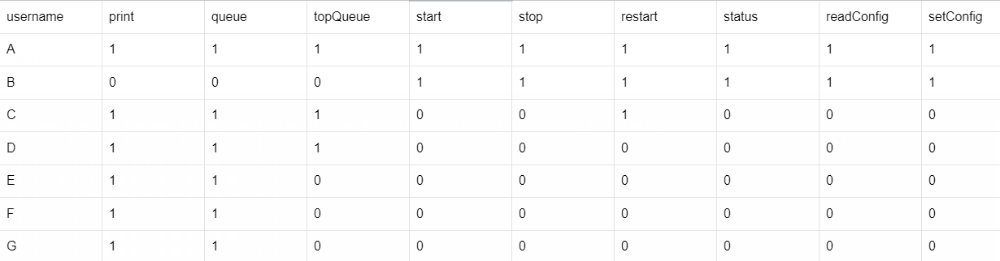
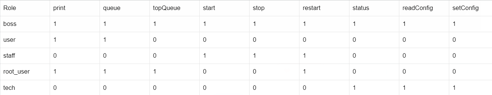
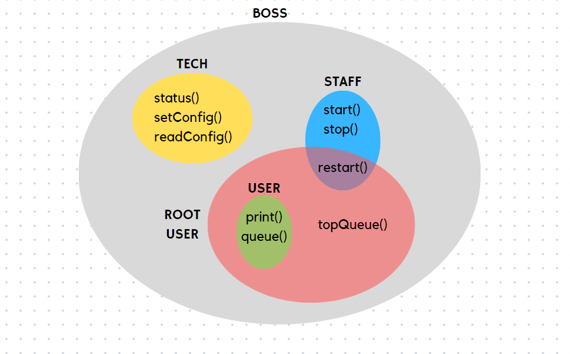
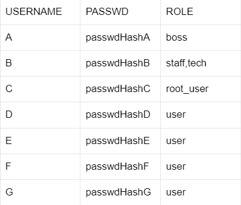
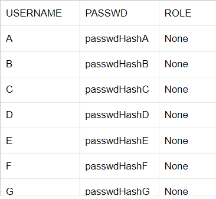
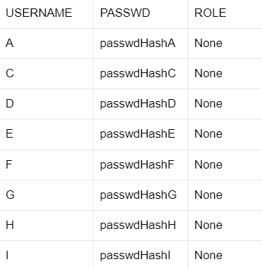
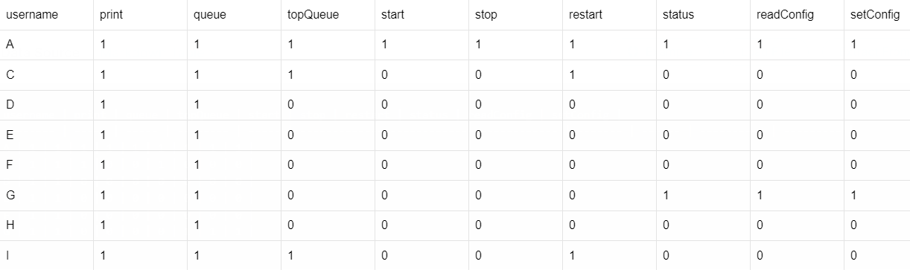
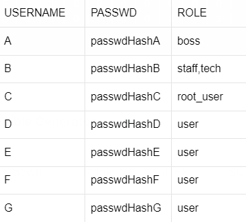
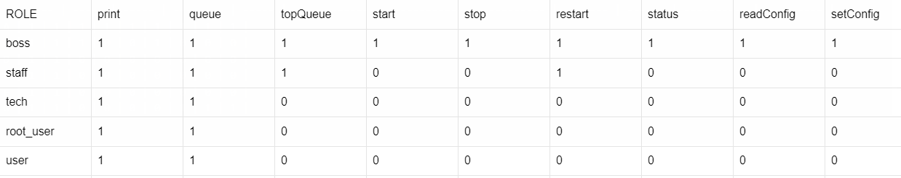
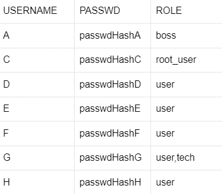

# Access Control Lab

> Group: 19
>
> - s233509: Giancarlo Andriano
> - s233508: Jawad Zaheer
> - s233511: Songlin Jiang

## Introduction

<!-- > (max 1 page)
> The introduction should provide a general introduction to the problem of access control in client/server applications. It should define the scope of the answer, i.e. explicitly state what problems are considered, and outline the proposed solution. Finally, it should clearly state which of the identified goals are met by the developed software. -->

Access control is a critical component in managing information security within any client/server system. It ensures that only authorized users can access specific resources, maintaining the integrity and confidentiality of sensitive data. Effective access control is pivotal in environments where information security is paramount.

The two primary access control models are Access Control Lists (ACL) and Role-Based Access Control (RBAC). ACLs are focused on individual users, granting specific permissions to each user for various operations. In contrast, RBAC assigns permissions based on user roles within the organization, streamlining the management of user privileges based on their job functions or responsibilities.

For the purpose of this AC lab, the goal is to achieve the following properties:

- Integrate both ACL and RBAC methodologies, making it possible to switch between the two.
- Independent management of ACL parameters with respect to the software application.
- Apply changes in organizational roles and responsibilities, ensuring ongoing relevance and effectiveness.
- Test software functionalities and correctness.

## Access Control Lists

<!-- > (max 2 pages)
> This section should provide a short overview of the implementation of the access control lists and the motivation behind all non-trivial design choices. -->

This paragraph presents a concise solution using the ACL mechanism. More precisely, by using the discretionary access control framework (DAC), an access control matrix summarises each user's permissions on each operation on the printing server. Moreover, the implementation uses a PostgreSQL database with primary key _username_ to reference all service users, and permissions to each resource are encoded with binary values (1=True or 0=False). Here is the overview of the matrix:

| **Table 1: Access control matrix for each user** |
| :----------------------------------: |
|          |

We use the `create_table.sql` file in order to create the above table and the user's table. Furthermore, the data is added to these tables manually due to the absence of any available APIs Moreover, the Java interface `Model` located in _dtu.compute.server.ac_ implements the access control mechanism. Our model interface is defined as follows:

```
public interface Model {
  boolean isMethodGranted(String username, String method);
}
```

The method `isMethodGranted` verifies the user's authorizations based on the username and method provided. The specifics of this verification depend on the class's implementation. Each of the two mechanisms will implement this method according to their own requirements for checking the user's permissions. The two implementations are defined in _dtu.compute.server.ac_ as follows: _List.java_ for ACL and _Role.java_ for Role-Based:

- List.java

```
@Override
public boolean isMethodGranted(String username, String method) {
    Map<String, Boolean> accessControlListByName = accessControl.getAccessControlListByName(username);
    boolean result = accessControlListByName.get(method);
    if (result) logger.info(String.format("%s is allowed to %s", username, method));
    else logger.info(String.format("%s is not allowed to %s", username, method));
    return result;
}
```

- Role.java

```
@Override
public boolean isMethodGranted(String username, String method) {
    Set<String> roleSet = new HashSet<>();
    String userRoleByName = user.getUserRoleByName(username);
    if (!userRoleByName.contains(",")) roleSet.add(userRoleByName);
    else roleSet.addAll(Arrays.stream(userRoleByName.split(",")).collect(Collectors.toList()));
    boolean result = isMethodGrantedForRole(method, roleSet);
    if (result) logger.info(String.format("%s with role %s is allowed to %s", username, userRoleByName, method));
    else logger.info(String.format("%s with role %s is not allowed to %s", username, userRoleByName, method));
    return result;
}
```

To switch between ACL and Role-Based control mechanisms, the software uses the configuration file _util.Configuration.java_ which contains a property named `accessControlModel`. This property can have two different values, namely:

- accessControlList
- roleBasedAccessControl

This property is used by _dtu.compute.server.print.Printer.java_ to check which type of AC to use during initialization:

```
if (Configuration.accessControlModel.equals("accessControlList"))
    accessControlModel = new dtu.compute.server.ac.List();
else if (Configuration.accessControlModel.equals("roleBasedAccessControl"))
    accessControlModel = new Role();
else
    logger.error("Invalid Configuration");
```

For every method within the printing system, the AC verification is implemented after checking user authentication. Permissions are checked through the specific implementation of `isMethodGranted` by providing username and method, then if the permission is not granted, the client will display a NOT_ALLOWED error message:

```
String methodName = new Object() {}.getClass().getEnclosingMethod().getName();
String userName = sessionUsers.get(access_token);
if (!accessControlModel.isMethodGranted(userName, methodName))
	return userName + NOT_ALLOWED + methodName;
```

The access control list will be kept in the database ensuring simultaneous access. Moreover, all the critical information is centralized outside the application, since all user's data is inside the database. Furthermore, we favored using Java interfaces to achieve a level of abstraction and encapsulation. This approach offers the flexibility to adapt to future modifications in access control methods, like incorporating role-based access control.

## Role Based Access Control

<!-- > (max 3 pages including diagrams)
> This section should document the results of the role mining process performed  in Task 2 and provide a short overview of the implementation of the role based access control mechanism implemented in Task 3 along with the motivation behind all non-trivial design choices. In particular, it must describe the syntax used to specify the RBAC policy. -->

The Role-Based implementation of the access control mechanism is defined in Table 2. Each role has different service permissions and they are organized in the hierarchical structure shown in Figure 1.


| **Table 2: Access control matrix for each role** |
| :----------------------------------: |
|         |

|  |
| :----------------------------------: |
|     **Figure 1: Role Hierarchy**     |

In order to use the Role-Based AC mechanism, the property `accessControlModel` contained in the file _util.Configuration.java_ is set to _roleBasedAccessControl_. Then, the class `Role.java` in _dtu.compute.server.ac_ handles the implementation of the Model.java interface. More precisely, it implements the two methods:

- `isMethodGranted`
- `isMethodGrantedForRole`

The former checks whether specific permission is granted to the specified role. The latter performs the same check but on sets of roles associated with the same user. Whenever a user has multiple roles, such a set is defined as a comma-separated sequence of roles, and service permissions are checked against each one of them. Hereby we provide the implementation:

```
public class Role implements Model {
    @Override
    public boolean isMethodGranted(String username, String method) {
        Set<String> roleSet = new HashSet<>();
        String userRoleByName = user.getUserRoleByName(username);
        if (!userRoleByName.contains(",")) roleSet.add(userRoleByName);
        else roleSet.addAll(Arrays.stream(userRoleByName.split(",")).collect(Collectors.toList()));
        boolean result = isMethodGrantedForRole(method, roleSet);
        if (result) logger.info(String.format("%s with role %s is allowed to %s", username, userRoleByName, method));
        else logger.info(String.format("%s with role %s is not allowed to %s", username, userRoleByName, method));
        return result;
    }

    private boolean isMethodGrantedForRole(String method, Set<String> roleSet) {
        for (var i : roleSet) {
            Map<String, Boolean> accessControlListByRole = accessControl.getAccessControlListByRole(i);
            if (accessControlListByRole.get(method)) return true;
        }

        return false;
    }
}
```

Finally, the PostgreSQL database no longer contains ACL permissions, rather the username, user's password and role as shown in the following structure:

| **Table 3: User's roles** |
| :----------------------------------: |
|          |


## Evaluation

<!-- > (max 4 pages)
> This section should document that the prototype enforces the access control policies defined in this assignment; both ACL and RBAC and both before and after the changes.
The evaluation should provide a simple summary of which of the requirements are satisfied and which are not. -->

This section provides an overview of our designed prototypes for AC policies. For testing, two specific clients have been designed. The client for the ACL case is named  `ClientACL.java`, and can be found in _dtu.compute.client_. It tests the ACL functionalities and implements all the table changes after the company's organisational restructuring. The second client in the same folder, named `ClientRole.java`, handles the same changes on the Role-Based implementation after filling up the role column in the user table. This test also verifies compliance with updated policy settings.

A first comment goes to the PostgreSQL database. In order to be able to handle both ACL and Role-Based AC mechanisms without data replication, we add the role field in the users table, with the initial value set as _None_. Its new structure is shown in Table 4:

| **Table 4: User table** |
| :----------------------------------: |
|          |

### ACL

In case of the ACL implementation, the user table solely handles user authentication, since specific access control policies are stored in the access control list table, as illustrated in Table 5.

| **Table 5: Access Control List** |
| :----------------------------------: |
|          |


After the organisational changes though, the content of both these tables is updated to reflect the recent shifts in the company's staff structure. Initially, B's records are deleted from both. Then, with G receiving as the new technician, G is granted the permissions to _status()_ _readConfig()_ and _setConfig()_ in the ACL.  Then H and I, the new employees, are inserted in the users table as simple users. The employee I is then given also permissions as root_user, meaning she is now also able to use topQueue() and restart(). After the changes, the updated tables are shown below:


| **Table 6: User table updated** |
| :----------------------------------: |
|          |

| **Table 7: Updated ACL** |
| :----------------------------------: |
|          |

Implementation of the ACL mechanism has helped us achieve the requirements stated below:    

- We set ACL requirements according to the given assignment description on the given users, and then model the AC mechanism using the client.

- ACL is stored in a separate environment from the application, precisely in a PostgreSQL database.

- We include the modifications to the ACL so that they will include the changes to the new company structure.

- Addition of `ClientACL.java` to simulate and validate the test cases in such a way that it tests the ACL functionalities and implements all the table changes for B, G, H and I.

### Role-Based evaluation

Thanks to its flexible design, the ACL table can now be used to assign specific permissions to each role in the company. For this specific application, it will therefore be shorter, and won't be modified by new hires in the company. 

| **Table 8: User table with roles** |
| :----------------------------------: |
|          |

| **Table 9: Roles permissions** |
| :----------------------------------: |
|          |


After initially populating the above tables according to the assignment description, company changes are reflected by the following operations: B is removed from the users table; the role of G is adjusted from "user" to "user,tech" meaning a role-set of 2 roles. As for the new employees, I is inserted into the users table and assigned the role of root_user, while H is designated as a user. As anticipated, there won't be any changes done to the roles permissions table. Table 10 shows the users table after the changes:

| **Table 10: Updated user table** |
| :----------------------------------: |
|          |

The implementation of the role-based access control mechanism has successfully met the following requirements:

- Development of the role-based access control mechanism prototype that simulates the running of role-based access control requirements for our users. This AC mechanism is also dynamically handled by the users table.

- Roles hierarchy are stored in the database as an access control matrix using their respective permissions.

- Incorporation of modifications to the role-based access control prototypes to reflect changes in company personnel.

- Addition of `ClientRole.java` to test the Role-Based implementation and company changes, by handling the updated policy settings for users B, G, H, I.

However, for practical purposes, our design choices fall short in two aspects. Firstly, there is no persistence in the database, meaning our implementation inserts users manually into the database during every initialization, after which both of the clients are tested. Secondly, there is no proper UI for the registration of users, which makes our application more difficult to navigate for non-expert users.

### Run the project

1. Run `docker compose up` to start a PostgreSQL database instance locally. All database schemas and initial role data are already located in `create_tables.sql` and will be executed automatically once the database is running.
2. Open the project in IntelliJ IDEA, all the configurations to run the project are already defined in `build.gradle` as tasks.

#### Run client based on ACL
1. Replace the value of string `accessControlModel` with `accessControlList` at `src/main/java/dtu/compute/util/Configuration.java`, so that the server understands that the client will use Access Control List for authentication.
2. Start the server by running the `server` task defined in `build.gradle`.
3. After the server is fully started, run the `clientACL` task to start the client. It will finish successfully if it passes all the tests.

#### Run client based on RBAC
1. Replace the value of string `accessControlModel` with `roleBasedAccessControl` at `src/main/java/dtu/compute/util/Configuration.java`, so that the server understands that the client will use Role Based Access Control for authentication.
2. Start the server by running the `server` task defined in `build.gradle`.
3. After the server is fully started, run the `clientRole` task to start the client. It will finish successfully if it passes all the tests.

You can find all the server logs under `logs/auth.log`.

## Discussion

<!-- > (max 2 page)
> This section documents the reflections and discussions of the final task. -->

The Access Control List (ACL) system is better suited for smaller organizations with less rigid hierarchies than the Role-Based Access Control (RBAC) system. ACL offers detailed control over individual user permissions, ideal for smaller teams where managing permissions is less complex. For instance, an administrator can easily adjust a user's permission for a specific operation by altering an entry in the ACL table. This precision makes ACL advantageous for companies like startups with around 20 employees, where roles are more fluid and resources are limited.

In contrast, RBAC is more efficient for larger organizations with many users and resources. It streamlines permission management by assigning users to predefined roles, reducing the administrative burden of managing individual permissions. This system is particularly useful in larger organizations with frequent employee role changes, as it minimizes the risk of misconfiguration and enhances security. RBAC's role-based approach simplifies managing complex access controls, making it less prone to errors than ACL in larger settings.

To handle the onboarding and offboarding scenarios, that were presented to us in the assignment description, both ACL and RBAC proved quite effective. If our requirements are related to handling permissions changes for the different users in an application, ACL would be more suitable. On the other hand, if we have a scenario where the organization has quite a lot of changes to employee roles or the addition or removal of employees, then RBAC mechanisms will be more suitable for such an organization.

## Conclusion

<!-- > (max 1 page)
> The conclusions should summarize the problems addressed in the report and clearly identify which of the requirements are satisfied and which are not (a summary of Section 4). The conclusions may also include a brief outline of future work. -->

In this exercise, we incorporated access control using two mechanisms namely ACL (access control list) and RBAC(role-based access control) in our previously developed authentication lab. Initially, we developed prototypes for both mechanisms and eventually refined them to adapt to actual roles in the company. Figure 1 presents a clearly defined role hierarchy. In order to test both our access control mechanisms (ACL and RBAC), we developed separate clients for each that simulate the provided organization scenarios in the assignment description.

In order to fulfill the assignment requirement of storage of ACL policies, we stored all the related information for both mechanisms in a PostgreSQL database. This also modeled a real-world scenario and then we defined a configuration variable `accessControlModel` to switch between the two AC mechanisms. Our implementation also covers all our requirements that were defined in the introduction section.

In the future, we can explore the integration of other access control mechanisms, such as attribute-based access control. A comparative analysis of the mechanisms discussed in this report could guide the selection of the most suitable one. Additionally, implementing a user-friendly interface for user registration and permission changes would enhance the overall user experience.
