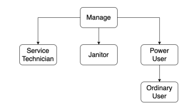

# Access Control Lab

> Group: 19
>
> - s233509: Giancarlo Andriano
> - s233508: Jawad Zaheer
> - s233511: Songlin Jiang

## Introduction

<!-- > (max 1 page)
> The introduction should provide a general introduction to the problem of access control in client/server applications. It should define the scope of the answer, i.e. explicitly state what problems are considered, and outline the proposed solution. Finally, it should clearly state which of the identified goals are met by the developed software. -->


Access control is a critical component in managing information security within any client/server system. It ensures that only authorized users can access specific resources, maintaining the integrity and confidentiality of sensitive data. Effective access control is pivotal in environments where information security is paramount.

The two primary access control models are Access Control Lists (ACL) and Role-Based Access Control (RBAC). ACLs are focused on individual users, granting specific permissions to each user for various operations. In contrast, RBAC assigns permissions based on user roles within the organization, streamlining the management of user privileges based on their job functions or responsibilities.

For the purpose of this AC lab, the goal is to achieve the following properties:

- Integrate both ACL and RBAC methodologies, making it possible to switch between the two.
- External management of ACL parameters.
- Apply changes in organizational roles and responsibilities, ensuring ongoing relevance and effectiveness.
- Use test cases to validate software functionalities and correctness.

## Access Control Lists

<!-- > (max 2 pages)
> This section should provide a short overview of the implementation of the access control lists and the motivation behind all non-trivial design choices. -->

This paragraph offers a concise of the project solution using ACL mechanism. More precisely, by using the discretionary access control framework (DAC), an access control matrix summarises each user's permissions on each operation on the printing server. Moreover,
the implementation uses an SQL table with primary key _username_ to reference all service users, and permissions to each resource are encoded with binary values (1=True or 0=False). Hereby the matrix overview:

| username | print | queue | topQueue | start       | stop | restart | status | readConfig | setConfig |
| -------- | ----- | ----- | -------- | ----------- | ---- | ------- | ------ | ---------- | --------- |
| Alice    | 1     | 1     | 1        | 1           | 1    | 1       | 1      | 1          | 1         |
| Cecilia  | 1     | 1     | 1        | 1           | 1    | 1       | 1      | 0          | 0         |
| Bob      | 0     | 0     | 0        | 1           | 1    | 1       | 1      | 1          | 1         |
| David    | 1     | 1     | 1        | 1           | 1    | 1       | 0      | 0          | 0         |
| Erica    | 1     | 1     | 1        | 0           | 0    | 0       | 0      | 0          | 0         |
| Fred     | 1     | 1     | 1        | 0           | 0    | 0       | 0      | 0          | 0         |
| George   | 1     | 1     | 1        | 0           | 0    | 0       | 0      | 0          | 0         |
|          |       |       |          | **Table-1** |      |         |        |            |           |

This table is recorded in a database table and is stored together with the user table. It's important to note that there are no available APIs for adding user information to both the access control list table and the user table. To include any pertinent data, one must directly manipulate the database or use JDBC APIs that are already integrated within the system.

To implement the access control mechanism in our application, we start by creating a Java interface in _dtu.compute.server.ac_ named  `Model`, which includes the following code:

```
public interface Model {
  boolean isMethodGranted(String username, String method);
}
```

This interface contains a single method, `isMethodGranted`, which takes the username and method name as arguments to check if the user is authorized to use the method. The specifics of this verification depend on the class's implementation. Each class that implements this interface will define its own way of checking user permissions, varying according to the access control mechanism used. The two implementations are defined in _dtu.compute.server.ac_ as follows: _List.java_ for ACL and _Role.java_ for Role-Based:

- List.java
```
@Override
public boolean isMethodGranted(String username, String method) {
    Map<String, Boolean> accessControlListByName = accessControl.getAccessControlListByName(username);
    boolean result = accessControlListByName.get(method);
    if (result) logger.info(String.format("%s is allowed to %s", username, method));
    else logger.info(String.format("%s is not allowed to %s", username, method));
    return result;
}
```

- Role.java
```
@Override
public boolean isMethodGranted(String username, String method) {
    Set<String> roleSet = new HashSet<>();
    String userRoleByName = user.getUserRoleByName(username);
    if (!userRoleByName.contains("&")) roleSet.add(userRoleByName);
    else roleSet.addAll(Arrays.stream(userRoleByName.split("&")).collect(Collectors.toList()));
    boolean result = isMethodGrantedForRole(method, roleSet);
    if (result) logger.info(String.format("%s with role %s is allowed to %s", username, userRoleByName, method));
    else logger.info(String.format("%s with role %s is not allowed to %s", username, userRoleByName, method));
    return result;
}
```

To switch between ACL and Role-Based control mechanisms, the software uses the configuration file _util.Configuration.java_ which contains a property named `accessControlModel`. This property can have two different values, namely:
- accessControlList
- roleBasedAccessControl

This property is used by _dtu.compute.server.print.Printer.java_ to check which type of AC to use during initialization:

```
if (Configuration.accessControlModel.equals("accessControlList"))
    accessControlModel = new dtu.compute.server.ac.List();
else if (Configuration.accessControlModel.equals("roleBasedAccessControl"))
    accessControlModel = new Role();
else
    logger.error("Invalid Configuration");
```


For every method within the printing system, the AC verification is implemented after checking user authentication. Permissions are checked through the specific implementation of  `isMethodGranted`, and after retreiving methodName and userName, if the permission is not granted, the client will display the NOT_ALLOWED error message:

```
String methodName = new Object() {}.getClass().getEnclosingMethod().getName();
String userName = sessionUsers.get(access_token);
if (!accessControlModel.isMethodGranted(userName, methodName))
	return userName + NOT_ALLOWED + methodName;
```

In terms of our design choices, we chose to keep the access control list in the database because it is well-suited for scenarios involving simultaneous access. Since we already decided to store user data in the database, it made sense to centralize all critical information in a single location instead of spreading it out. Furthermore, we favored using Java interfaces to achieve a level of abstraction and encapsulation. This approach offers the flexibility to adapt to future modifications in access control methods, like incorporating role-based access control.

In order to check for correct behaviour and implementation, the Client in _dtu.compute.client_ asserts the different (???)

___________________________________________________________^^^ DONE SO FAR ^^^^__________________________________________


To assess the functionality of the access control list mechanism, we introduced a corresponding integration test named `AccessControlListTest`. Notably, the database tables are devoid of information at program startup. During test execution, user information and associated permissions are inserted, and subsequently, these entries are cleared upon test completion. In a practical implementation, user credentials and the access control list ought to be contained in the database.

## Role Based Access Control

<!-- > (max 3 pages including diagrams)
> This section should document the results of the role mining process performed in in Task 2 and provide a short overview of the implementation of the role based access control mechanism implemented in Task 3 along with the motivation behind all non-trivial design choices. In particular, it must describe the syntax used to specify the RBAC policy. -->

For the subsequent assignment, our objective involves recognizing the roles, outlining a hierarchical structure for these roles, and specifying permissions for each role in order to enact the prescribed access control strategy. The roles and their hierarchical arrangement are presented in Table 2, as well as depicted in Figure 1 and Figure 2.

| username      | print | queue | topQueue | start       | stop | restart | status | readConfig | setConfig |
| ------------- | ----- | ----- | -------- | ----------- | ---- | ------- | ------ | ---------- | --------- |
| manager       | 1     | 1     | 1        | 1           | 1    | 1       | 1      | 1          | 1         |
| ordinary_user | 1     | 1     | 0        | 0           | 0    | 0       | 0      | 0          | 0         |
| janitor       | 0     | 0     | 0        | 1           | 1    | 0       | 0      | 0          | 0         |
| power_user    | 1     | 1     | 1        | 0           | 0    | 1       | 0      | 0          | 0         |
| service_tech  | 0     | 0     | 0        | 0           | 0    | 0       | 1      | 1          | 1         |
|               |       |       |          | **Table-2** |      |         |        |            |           |

|  |
| :---------------------------------------: |
|       **Figure: 1 Role Heirarchy**        |

|  |
| :-----------------------------------------------------------------: |
|              **Figure: 2 Role Heirarchy Venn Diagram**              |

The presence of five distinct roles is evident, with the table illustrating the permissions associated with each operation for every role. Similar to Table 1, the representation involves assigning 1 for true and 0 for false.

To articulate the role-based access control (RBAC) policy, an additional column is introduced into the user table to store the user's designated role. If a user assumes multiple roles, these roles are linked with the "&" symbol, exemplified in Table 3.

The application of the specified role table for RBAC mechanism implementation begins with the creation of a new subclass termed RoleBasedControl, which implements the AccessControlModel interface, as outlined below:

| **username** | **role**                        | **password_hash** |
| ------------ | ------------------------------- | ----------------- |
| Alice        | manager                         | xxx               |
| Cecilia      | power_user                      | xxx               |
| David        | ordinary_user                   | xxx               |
| Bob          | janitor/service                 | xxx               |
| Fred         | ordinary_user                   | xxx               |
| George       | ordinary_user                   | xxx               |
| Erica        | ordinary_user                   | xxx               |
|              | Table 3: User Table with Roles: |                   |

```
public class RoleBasedControl implements AccessControlModel{
    @Override
    public boolean isMethodGranted(String username, String method)
    {
        Set<String> roleSet = new HashSet<>();
        String userRoleByName = userRepository.getUserRoleByName(username);
        if (!userRoleByName.contains("&"))
        roleSet.add(userRoleByName);
        else
        roleSet.addAll(Arrays.stream(userRoleByName.split("&")).toList());
        return isMethodGrantedForRole(method, roleSet);
    }
}
```

The modified function, `isMethodGranted`, entails retrieving the roles linked to the user from the user table. Subsequently, the role string is disentangled using the "&" symbol, and the resulting components are stored in the role set. The ensuing method, `isMethodGrantedForRole`, examines whether the role linked to the user facilitates the execution of the specified method. The specifics of the `isMethodGrantedForRole` function are expounded upon as follows:

```
private boolean isMethodGrantedForRole(String method, Set<String> roleSet) {
    for (var i : roleSet) {
        Map<String, Boolean> accessControlListByRole = roleRepository.
        getAccessControlListByRole(i);
        if (accessControlListByRole.get(method))
        return true;
    }
    return false;
}

```

For the activation of the access control mechanism based on roles, an adjustment in the configuration file service.properties is requisite. The alteration pertains to the key accessControlModel, with the new value set as "roleBasedAccessControl," as exemplified below:

```
accessControlModel = roleBasedAccessControl
```

Similar to the approach adopted for the access control list, we opt to maintain the role table in the database to ensure uniformity in data storage. Additionally, we introduce a relevant integration test titled RoleBasedControlTest to validate the efficacy of the Role Based Access Control mechanism.

## Evaluation

<!-- > (max 4 pages)
> This section should document that the prototype enforces the access control policies defined in this assignment; both ACL and RBAC and both before and after the changes.
The evaluation should provide a simple summary of which of the requirements are satisfied and which are not. -->

Within this segment, we provide an account of the prototype that enforces the access control policies outlined in this task. Commencing with the discussion on access control list (ACL), two tables are pertinent to ACL, specifically the user table and the access control list table. The existing contents of these tables before any modifications are presented below:

| **username** | **role**                | **password_hash** |
| ------------ | ----------------------- | ----------------- |
| Alice        | none                    | xxx               |
| Cecilia      | none                    | xxx               |
| David        | none                    | xxx               |
| Bob          | none                    | xxx               |
| Fred         | none                    | xxx               |
| George       | none                    | xxx               |
| Erica        | none                    | xxx               |
|              | **Table 4: User Table** |                   |

In this context, the role attribute for all users is configured as "none" since we are presently utilizing the access control list mechanism. The role attribute is irrelevant to our current scenario, and its assignment to "none" signifies that this attribute is not active. Additionally, the password hashes are excluded in this presentation.

The user table, in this instance, solely handles user authentication. Detailed access control policies are stored in the access control list table, as illustrated in Table 5.

| username | print | queue | topQueue | start | stop                             | restart | status | readConfig | setConfig |
| -------- | ----- | ----- | -------- | ----- | -------------------------------- | ------- | ------ | ---------- | --------- |
| Alice    | 1     | 1     | 1        | 1     | 1                                | 1       | 1      | 1          | 1         |
| Cecilia  | 1     | 1     | 1        | 0     | 0                                | 1       | 0      | 0          | 0         |
| Bob      | 0     | 0     | 0        | 1     | 1                                | 1       | 1      | 1          | 1         |
| David    | 1     | 1     | 0        | 0     | 0                                | 0       | 0      | 0          | 0         |
| Erica    | 1     | 1     | 0        | 0     | 0                                | 0       | 0      | 0          | 0         |
| Fred     | 1     | 1     | 0        | 0     | 0                                | 0       | 0      | 0          | 0         |
| George   | 1     | 1     | 1        | 0     | 0                                | 0       | 0      | 0          | 0         |
|          |       |       |          |       | **Table 5: Access Control List** |
|          |       |       |          |

Following this, alterations are made to the content of the two tables to align with modifications in the company's personnel. Initially, Bob's details are removed from both the user table and access control list table. Subsequently, as George assumes some of Bob's responsibilities and takes on the role of a service technician, corresponding permissions are assigned to George in the access control list. New employees can be effortlessly incorporated into both the user table and access control list table, accompanied by relevant permission details. Post the organizational changes, the revised content of the two tables is illustrated in Table 6 and Table 7.

For specific testing purposes, two integration tests have been defined. The first, mentioned in section 2, is termed `AccessControlListTest`, examining the functionality of the access control list prototype. The second test, named `StaffChangeOnAccessControlListTest`, involves adding all initial employees to the database and subsequently modifying the database content to simulate shifts in company staff. This test evaluates whether the ACL mechanism effectively adheres to the revised policies.

| **username** | **role**                        | **password_hash** |
| ------------ | ------------------------------- | ----------------- |
| Alice        | none                            | xxx               |
| Cecilia      | none                            | xxx               |
| David        | none                            | xxx               |
| Ida          | none                            | xxx               |
| Fred         | none                            | xxx               |
| George       | none                            | xxx               |
| Erica        | none                            | xxx               |
| Henry        | none                            | xxx               |
|              | **Table 6: User Table Updated** |
|              |

| username | print | queue | topQueue | start | stop                                     | restart | status | readConfig | setConfig |
| -------- | ----- | ----- | -------- | ----- | ---------------------------------------- | ------- | ------ | ---------- | --------- |
| Alice    | 1     | 1     | 1        | 1     | 1                                        | 1       | 1      | 1          | 1         |
| Cecilia  | 1     | 1     | 1        | 0     | 0                                        | 1       | 0      | 0          | 0         |
| David    | 1     | 1     | 0        | 0     | 0                                        | 0       | 0      | 0          | 0         |
| Erica    | 1     | 1     | 0        | 0     | 0                                        | 0       | 0      | 0          | 0         |
| Fred     | 1     | 1     | 0        | 0     | 0                                        | 0       | 0      | 0          | 0         |
| George   | 1     | 1     | 0        | 0     | 0                                        | 0       | 1      | 1          | 1         |
| Ida      | 1     | 1     | 1        | 0     | 0                                        | 1       | 0      | 0          | 0         |
| Henry    | 1     | 1     | 0        | 0     | 0                                        | 0       | 0      | 0          | 0         |
|          |       |       |          |       | **Table 7: Access Control List Updated** |
|          |       |       |          |

The implementation of the access control list mechanism has successfully met the following requirements:

• Development of the access control list mechanism prototype.
• Specification of the access control list in an external file.
• Incorporation of modifications to the access control list prototype to reflect changes in company personnel.
• Introduction of a unit test named `AccessControlListTest` to assess the functionality of the access control list mechanism, ensuring effective user access control.
• Integration of a unit test named `StaffChangeOnAccessControlListTest` to simulate shifts in company staff and validate the adaptive nature of the access control list mechanism.

Subsequently, we transition to role-based access control (RBAC). Two pertinent tables associated with RBAC include the user table and the roles table, presented in Table 8 and Table 9.

| **username** | **role**                           | **password_hash** |
| ------------ | ---------------------------------- | ----------------- |
| Alice        | manager                            | xxx               |
| Cecilia      | power_user                         | xxx               |
| Bob          | janitor&service_tech               | xxx               |
| David        | ordinary_user                      | xxx               |
| Erica        | ordinary_user                      | xxx               |
| Fred         | ordinary_user                      | xxx               |
| George       | ordinary_user                      | xxx               |
|              | **Table 8: User Table with roles** |
|              |

| username      | print | queue | topQueue | start | stop                        | restart | status | readConfig | setConfig |
| ------------- | ----- | ----- | -------- | ----- | --------------------------- | ------- | ------ | ---------- | --------- |
| manager       | 1     | 1     | 1        | 1     | 1                           | 1       | 1      | 1          | 1         |
| janitor       | 1     | 1     | 1        | 0     | 0                           | 1       | 0      | 0          | 0         |
| power_user    | 1     | 1     | 0        | 0     | 0                           | 0       | 0      | 0          | 0         |
| service_tech  | 1     | 1     | 0        | 0     | 0                           | 0       | 0      | 0          | 0         |
| ordinary_user | 1     | 1     | 0        | 0     | 0                           | 0       | 0      | 0          | 0         |
|               |       |       |          |       | **Table 9: The role table** |
|               |       |       |          |

In contrast to the previous table, roles are introduced for users in this setup, with the password_hash field still excluded. To accommodate changes in the company's organizational structure, the initial step involves removing Bob from the user table. Subsequently, the role of George is adjusted from "ordinary_user" to "ordinary_user&service_tech," with different roles connected using "&."For the two recently included employees, Ida is assigned the role of power_user, while Henry is designated as an ordinary_user. It's worth noting that the role table remains unchanged, as no alterations to roles have occurred. The updated user table is presented in Table 10.

| **username** | **role**                         | **password_hash** |
| ------------ | -------------------------------- | ----------------- |
| Alice        | manager                          | xxx               |
| Cecilia      | power_user                       | xxx               |
| David        | ordinary_user                    | xxx               |
| Fred         | ordinary_user                    | xxx               |
| Erica        | ordinary_user                    | xxx               |
| George       | ordinary_user&service_tech       | xxx               |
| Henry        | ordinary_user                    | xxx               |
| Ida          | power_user                       | xxx               |
|              | **Table 10: User Table updated** |
|              |

The implementation of the role-based access control mechanism has successfully met the following requirements:

• Development of the role-based access control mechanism prototype.
• Specification of the role hierarchy in an external file.
• Incorporation of modifications to the role-based access control prototypes to reflect changes in company personnel.
• Introduction of an integration test named `RoleBasedControlTest` to assess the functionality of the role-based access control mechanism, ensuring effective user access control.
• Implementation of an integration test named `StaffChangedOnRoleBasedControlTest` to simulate shifts in company staff and validate the adaptive nature of the role-based access control mechanism.

However, both access control systems fall short in addressing two major requirements. Firstly, the absence of a registration API necessitates manual insertion of all users into the database. For testing purposes, users are initially inserted through the database API, after which the access control mechanism is tested on them. Secondly, there is a lack of APIs to facilitate changes in user permissions, which can only be achieved through direct manipulation of the database. These limitations contribute to the application's complexity in user management. Additionally, the absence of a proper UI must be acknowledged as a drawback, as it is crucial for the practical usability of the application.

## Discussion

<!-- > (max 2 page)
> This section documents the reflections and discussions of the final task. -->

In contrast to the role-based access control (RBAC) mechanism, we posit that the access control list (ACL) mechanism provides greater flexibility for organizations with less pronounced hierarchies. The ACL allows administrators to finely define the permissibility of each operation for specific users, making it suitable for smaller organizations with manageable effort requirements. Conversely, RBAC governs operation permissions collectively, making ACL a favorable choice for organizations desiring fine-grained access control. For minor adjustments, such as permitting Erica to perform a restart operation, the admin only needs to modify the corresponding ACL table value from 0 to 1. If RBAC is employed, the admin must create a new role for this change, potentially leading to role redundancy and management challenges. If frequent fine-grained permission changes occur, RBAC may prove more cumbersome to handle.

This advantage is particularly evident in systems with fewer users, such as startups with around 20 employees and limited resources. In such dynamic environments where employee roles are fluid, an ACL system offers superior adaptability.

Contrary to ACL, we posit that the strength of RBAC lies in its ability to efficiently manage permissions for a large number of users accessing numerous resources. This is especially beneficial for large organizations, alleviating administrative burdens compared to ACL. In RBAC, the role system acts as middleware, simplifying the complexity of concrete permission control. Admins only need to ensure that users are assigned the correct role, without delving into intricate access control policies to detect potential permission misassignments. In significant organizations where employee position changes occur frequently, RBAC significantly reduces the risk of misconfiguration and enhances system security.

Regarding expressive power, we contend that both ACL and RBAC adeptly capture organizational changes related to user enrollment and departure. ACL excels in specifying user permission adjustments, while RBAC is particularly effective in delineating changes in employee positions, especially when such changes are commonplace.

## Conclusion

<!-- > (max 1 page)
> The conclusions should summarize the problems addressed in the report and clearly identify which of the requirements are satisfied and which are not (a summary of Section 4). The conclusions may also include a brief outline of future work. -->

In this laboratory exercise focused on access control, we integrated access control mechanisms into the system previously developed in the authentication laboratory. The implemented access control mechanisms encompass the access control list (ACL) and role-based access control (RBAC). Initially, we constructed prototypes for both mechanisms and subsequently refined them to adapt to organizational changes in employee roles. Two distinct figures present a clearly defined role hierarchy. To ensure the accuracy of these mechanisms, we developed corresponding integration tests to simulate their expected functionality.

Additionally, we fulfilled the requirement of documenting the access control policy in external media. Similar to the previous lab, we stored relevant information in the database, aligning with real-world system practices. A configuration item was defined to facilitate the switch between the two access control mechanisms, covering all outlined requirements in Section 1 Introduction. However, certain unmet requirements include the absence of an interface for user registration and permission changes, impacting the practical utility of the application. Moreover, from the user's perspective, the system lacks a proper user interface; all functions are invoked through Java Remote Method Invocation, making practical use challenging.

For future endeavors, we posit that exploring the integration of other access control mechanisms, such as attribute-based access control, could be beneficial. A comparative analysis with the mechanisms discussed in this report could guide the selection of the most suitable one. Additionally, prioritizing the implementation of a user-friendly interface would enhance the overall user experience.
