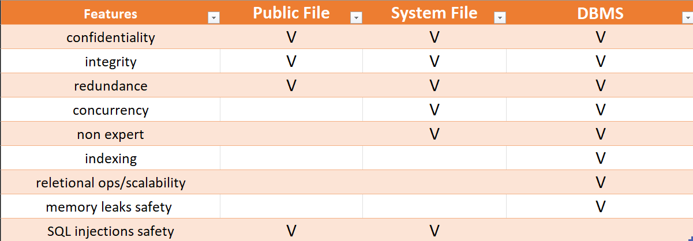

# Authentication Lab
> Group: 19
> - s233509: Giancarlo Andriano
> - s233508: Jawad Zaheer
> - s233511: Songlin Jiang

## Introduction
<!-- > (max 1 page)
> The introduction should provide a general introduction to the problem of authentication in client/server applications. It should define the scope of the answer, i.e. explicitly state what problems are considered, and outline the proposed solution. Finally, it should clearly state which of the identified goals are met by the developed software. -->

The following security goals must be ensured for a safe client/server application:

- **Protection of User Credentials**:  User credentials must be kept secret. Also, supposing a scenario where data leaks happen, brute force attacks should be made impractical to implement on leaked data.

- **Credential Hashing**: Users' passwords should be hashed and protected against brute force and rainbow table attacks. Also the hashes should not be made deterministic, in case multiple users use the same password to autenticate.

- **Server Independence from Plaintext Passwords**: The server doesn't handle users' plain-text passwords. This precaution ensures security in scenarios where the server may be comprimised without client knowledge.

- **Protection Against Data Leaks**: Data should be safely stored and inputs should be safely handled and sanitized to provide protection against data leaks, memory dumps or SQL injections.

- **Secure Communication**: Enforce security on the communication channels with TLS, providing confidentiality and integrity guarantees. Server identity should always be verified before every interaction.

For our implementation, we decided to store user passwords in a DBMS. For password hashing, we employ the Bcrypt library and the PBKDF2 hashing algorithm, which provides better robustness and resistance to brute force or rainbow tables attacks. To thwart SQL injection attacks, our software utilizes the java.sql.PreparedStatement interface, and we use the mature open source PostgreSQL database. We assume the service is deployed using certificates and TLS to meet the last security requirement, while all the others are supported by our implementation.

## Authentication
<!-- > (max 3 pages)
> This section should provide a short introduction to the specific problem of password based authentication in client/server systems and analyse the problems relating to password storage (on the server), password transport (between client and server) and password verification. -->

The databased is provisioned with a testuser and its password to test the application. Moreover, the server manages the user authentication using _printer.authenticate()_ primitive which takes users' username and password hash. If the printer service tried to be accessed prior authentication, an error message is returned to user.

If the authentication is successful, the server creates a session for the user an issues a unique string as a access token to the client using UUID and session time. Whilst token's limited time validity,  the client can access the print service by calling each API and providing the access token in the request, without the need for reauthentication. Reauthentication is required only in case user performs stop or restart operations or when user's session expires.

### Password Storage

We decided to implement our solution using a DBMS. Our design choice was driven by an analysis of desirable and provided features for each suggested method of password storing mechanism. Hereby a detailed description of our reasoning: 




#### Confidentiality
DBMS ensures strong data confidentiality through already implemented encryption and precise access controls, guarding user credentials securely. System files offer basic confidentiality based on file permissions, while public files rely on encryption to protect data privacy.

#### Integrity
DBMS maintain data integrity via transaction management and data constraints, guaranteeing consistency. System files and public files use file permissions and sys call to guarantee this property, therefore relying on safe kernel primitives.

#### Redundance
While DBMS support redundancy by offering various data replication and backup mechanisms (such as transactional, snapshot and merge), files provide limited redundancy options, mainly through per-file backup processes. In any case, even if the issue is addressed differently, all the three options provide this feature.

#### Concurrency
In terms of concurrent data access, DBMS efficiently manage multiple users through atomic operations and transactions on the tables. System files are provided support for concurrency via specific kernel sys call, though synchronization with backup data has to be maintained separately by developers. In this sense, public files are even trickier to handle since they are not provided with a default solution and deserve a concurrency implementation on their own, e.g., through semaphores.

#### Non-expert Usability
DBMS offer user-friendly APIs that make them accessible to developers and administrators. System files provide basic sys calls for file management, requiring basic level of expertise. Public files, however, need cryptographic implementations, which can be challenging for non-experts and are potentially dangerous if non-standardized or personalized crypto libraries are used instead of reliable ones. 

#### Indexing
DBMS excel in data indexing, with tweakable data granularity guaranteed by relational operations, significantly enhancing data access efficiency. On the other hand, files lack indexing support, leading to slower data retrieval, and adding non-negligible overhead to the server. Also write operations on big file are inefficient compared to fast indexed in-row modifications in DBMS.

#### Relational ops/scalability
DBMS are the only one supporting relational operations. This is extremely useful when the database architecture has to be extended in some way. In this case, we may want to give some users specific access to only certain printers or provide different printing pricing offers depending on user type (say staff, student or guest). 

#### Memory leaks safety
Memory leaks generally represent a critical concern in the secure storage of user credentials. DBMS offer an inherent advantage by managing encryption and decryption processes in a controlled environment, minimizing the risk, for instance by splitting data at random addresses. This is because DBMS operate within a structured framework that allocates and releases memory systematically. System files rely on kernel memory management mechanism and are handled in kernel mode via sys calls. On the other hand, when dealing with encryption and decryption within public files, there is a higher vulnerability to memory leaks, especially in the presence of malicious memory dumpers or unsafe crypto libraries. 

#### SQL injections safety
DBMS are, in this case, the only vulnerable storage type to such attacks if input sanitization and checks are not properly implemented. Therefore, as we did, they must be protected using prepared statements and query parameterization to mitigate the risk effectively.


### Password Transmission
In order to ensure the confidentiality and integrity of the information sent to the server, TLS would prevent an attacker to gain insights about the data by tampering during transmission. Therefore with focused our attention to sessions authentication. On the client-side, the user's password is pre-hased using PBKDF2 algorithm which outputs a 256-bit key and then sent to the server.

#### Authentication of Individual Requests
Client will sent its username and password to the server and server will retrieve the corresponding hash of the password from the database using the clien's username. Then server uses the hash algorithm PDKDF2 to compare the original hash of the password with the transmitted one. In case of a match we proceees further as its a success case.

#### Authenticating Sessions for Clients
Authentication fo individual sessions is required before establishing an authenticated session. Upon successful initial authentication, a session object is created alongside a UUID and we store this pair inside a map for future access, with the UUID sent to client as an access token. Now this established session is valid for a specific timeframe during which client can authenticate itself with doing the steps for initial individual authentication using its access token. The server checks the associated session on the basis of this token in order to find out whether the session is expired or not. Furthermore, TLS ensures the confidentiality and integrity of the access token.

### Verification of the Password
The client sends its username and password to the server which uses JDBC (Java Database Connectivity) in order to access the database and retrieve hashed password correspoding to the user. Then we use BCrypt library jBCrypt's method `checkpwcandidate, hashed)` to verify this received password. Similarly when registering the user, the same library is used to hash the passowrd prior to saving it in the database using the method `hashpw(password, BCrypt.gensalt())`, which automatically handles the salt.
Our reasoning for this approach is that users may use the same passwords across mulitpel servers. So using salt helps in two ways: firstly it ensures users with the same password have different stored hashes in the database. Secondly, same passwords stored in different servers/services are different among each other because of the salt. This ensures that data leaks on a server do not expose all other accounts to other servers or services having the same password.

## Design and Implementation
<!-- > (max 3 pages including diagrams)
> A software design for the proposed solution must be presented and explained, i.e. why is this particular design chosen. The implementation of the designed authentication mechanism in the client server application must also be outlined in this section. -->
The project follows a client-server architecture, with the interaction between the two implemented through Java Remote Method Invocation (RMI). The server exposes a set of methods for the client to utilize, detailed in the table below:

| Method          | Description                                                        |
|-----------------|--------------------------------------------------------------------|
| print           | Prints file filename on the specified printer.                 |
| queue           | Lists the print queue for a given printer on the user's display in lines of the form \<job number>   \<file name>                     |
| topQueue        | Moves job to the top of the queue.                  |
| start           | Starts the print server.                                      |
| stop            | Stops the print server.                                           |
| restart         | Stops the print server, clears the print queue and starts the print server again.                                        |
| status          | Prints status of printer on the user's display.                          |
| readConfig      | Prints the value of the parameter on the print server to the user's display.                          |
| setConfig       | Sets the parameter on the print server to value.                             |
| authenticate    | Performs user authentication and returns a session access token.     |

#### Design

The architecture of the project is illustrated in the following diagram.
```
.
└── dtu
    └── compute
        ├── client
        │   └── Client.java
        ├── server
        │   ├── print
        │   │   ├── Printer.java
        │   │   ├── PrinterServant.java
        │   │   └── PrinterService.java
        │   ├── Server.java
        │   └── Session.java
        └── util
            ├── Configuration.java
            ├── Crypto.java
            └── DB.java
```

This architecture comprises several key components:

1. **dtu.compute.client.Client:** Simulates user behavior within the printing system. The client can execute all actions outlined in table above. Authentication is typically the initial step, while stopping the service is the final one.

2. **dtu.compute.server.print:** Emulates services provided by a physical printer. Details are outlined in table above. The user will need to authenticate itself for using the printer before its started.

3. **dtu.compute.server.Session:** Manages user sessions. The client specifies the time duration for the session initially and afterwards user's credentials (password and username) aren't requried to be sent again.

4. **dtu.compute.util.DB:** For the purpose for storing user related information and managing it, we would need the use of a database. Futhermore, DBMS offer adequate performance because of isolation mechanisms for data when we consider data manipulation and concurrent access for users. PostgreSQL is chosen as the specific database system due to its maturity, widespread use, and trustworthiness in handling storage needs without significant security concerns. Instead of setting up a local database, a cloud service provided by ElephantSQL is employed to allow for easy scalability with an increasing user base and to mitigate potential single point of failure issues associated with centralized database systems.

5. **dtu.compute.util.Crypto:** Responsible for authenticating clients.

8. **Log System:** Records user behavior for future examination. These logs are arranged upon the size and date of the entered data with sizes upto 100KB and we use Log4j2 library for this purpose.

#### Implementation of Authentication Mechanism

The detailed implementation of the authentication mechanism is as follows:

1. **Addition of Test Users:** 
 `addUser` method is used to insert the users to the database since we don't support it through any interactive way from the frontend. The test user password is retrieved from `Configuration.java` and hashed using the PBKDF2 algorithm with SHA512, and then additionally hased with a unique salt using the jBcrypt library insde `Crypto.java`. We will save the username and the hashed password inside our POSTGRE SQL database. The list of users to be added 

    ```java
    db.addUser(Configuration.testUsername, Crypto.salt(pwHash));
    ```

2. **Authentication of the client on the server:** The client authenticates itself using username, password and further uses a parameter to specify the valid session time using `authenticate` method in `PrintServant.java`. The server then retrieves the client's data from the database based upon the username and checkPassword based upon the hashes from user and database. An appropriate response will be send to the end user if the information is not found in the database such as due to some invalid username. Finally the authentication is deemed successful or a failure based upon its verification by jBcrypt library. The exact method used is:

    ```java
    BCrypt.checkpw(userHash, dbHash)
    ```

    This method will also create a session object for the user based upon the time requested from the client in order to remember it and an access token based upon uuid will be created subsequently to remember the client with this session which will be sent as a response to the user.

3. **Authentication Session:** The client uses the access token generated during the initial authentication to perform the different printer operations within the validity period using `isAuthenticated` method inside `PrintServant.java`. The server validates the access token for each request to check if the session is outdated or not. In case, its outdated the client needs to reauthenticate itself and its session data is removed from the Sessions mapping. The logic to check the session is:

    ```java
    System.currentTimeMillis() - startTime <= (validTime * 1000L);
    ```

## Evaluation
<!-- > (max 2 pages)
> This section should document that the requirements defined in Section 2 have been satisfied by the implementation. In particular, the evaluation should demonstrate that the user is always authenticated by the server before the service is invoked, e.g. the username and methodname may be written to a logfile every time a service is invoked. The evaluation should provide a simple summary of which of the requirements are satisfied and which are not. -->

### Security Requirements
#### Password Transport

Supposing the usage of TLS, many risks regarding channels security are already minimized. TLS 1.3 implements by default data encryption with HMAC, and server identity is verified against certificate signatures. This ensures that all communication between our printing server and the client is secure. Moreover, passwords are never sent in plain-text

#### Password Verification

After the client submits their login credentials, which consist of a username and a password, the server proceeds to compare the provided password with the BCrypt hash stored in the database. To bolster security, a set of specific security measures were implemented. The system deliberately ensures that failed authentication responses do not disclose any information, thereby preventing potential attackers from conducting user enumeration attacks. Furthermore, the system effectively combats time-based attacks by ensuring that the authentication response consistently takes the same amount of time, regardless of whether the user's information is found in the database. Once the verification process is successfully completed, the server issues the client a secure access token, which will be used future requests. This access token is generated using Java's random UUID method. In case the client wishes to end their session, they can request a stop command, which will result in the removal of their access token. Additionally, the system incorporates a session timeout feature, prompting users to log in again after a specified time period.

#### Password Storage

Regarding storing passwords, two factors were considered: where and what to store. We opted for a database to store passwords due to its security and scalability. PostgreSQL allows multiple servers to share storage, and backups for data recovery are easily implementable as well. Only authorized accounts have admin permission on the DBMS and input sanitization is properly done using Java libraries.

#### Verifying Security Requirements

Maintaining the security of databases is of utmost importance, necessitating the adoption of stringent measures for storing passwords in a highly secure manner, ensuring that even in the event of a database breach, retrieving the actual password remains a challenging. We abstain from storing passwords in their plain, readable form; instead, we securely retain their hash. We employ the BCrypt hashing algorithm, specifically designed to thwart offline password cracking endeavors. To further bolster security, a unique salt is applied to each password, effectively countering rainbow table attacks. Finally, PDKDF2 involves subjecting passwords to 210 rounds of hashing, deliberately slowing down brute-force search attempts.
Moreover, we take the additional precaution of never transmitting passwords in plain text to the server. Instead, we hash the password on the client's side prior to any data transmission, thus eliminating the risk of accidental or malicious logging of plain text passwords.


### Logging

Logs are created for a particular service using the called method's specifications such as name and the end user who requested it. This ensures authentication of the end users for that particular service. The logging functionality happens after we check the access token of the user and its password (in case of initial authentication) inside `authenticate` method.

Sample log output for invoking the print service:

```
2023-10-26 17:13:10 INFO  testuser auth success.
2023-10-26 17:13:10 INFO  testuser service req: start
2023-10-26 17:13:10 INFO  testuser service req: print
2023-10-26 17:13:10 INFO  printer1-test1.txt queued in print service.
```

## Conclusion
<!-- > (max 1 page)
> The conclusions should summarize the problems addressed in the report and clearly identify which of the requirements are satisfied and which are not (a summary of Section 4). The conclusions may also include a brief outline of future work. -->

Our exploration centered on the specific challenges associated with password-based authentication in client/server systems, covering aspects like the secure storage, transmission, and validation of passwords. Building upon these considerations, we conducted assesauth success.sments from various perspectives, confirming that both the printing service and the authentication mechanism function as intended. 
