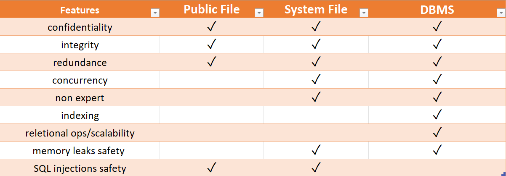

# Authentication Lab
> Group: 19
> - s233509: Giancarlo Andriano
> - s233508: Jawad Zaheer
> - s233511: Songlin Jiang

## Introduction
<!-- > (max 1 page)
> The introduction should provide a general introduction to the problem of authentication in client/server applications. It should define the scope of the answer, i.e. explicitly state what problems are considered, and outline the proposed solution. Finally, it should clearly state which of the identified goals are met by the developed software. -->

Our implementation stores credentials in a database, so to ensure the following security goals:

- **Protection of User Credentials**: The attacker should be unable to discern user credentials from the communication channel. Also even if the database is compromised, the attacker should not gain access to plain-text user credentials. Finally, supposing a scenario where data leaks happen, brute force attacks should be made impractical to implement.

- **Credential Hashing**: Users' passwords should be protected against brute force and rainbow table attacks. Also they should not be made deterministic, in case multiple users use the same password to autenticate.

- **Server Independence from Plaintext Passwords**: The server doesn't handle users' plaintext passwords. This precaution ensures security in scenarios where the server may be comprimised without client knowledge.

- **Protection Against Database Attacks**: Data should  be safely handled and sanitized in the database to provide protection against db attacks, e.g, SQL injections.

- **Secure Communication**: Enforce secure communication over the internet using TLS, which provides confidentiality and integrity guarantees.

In our implementation, for password hashing, our design employs the Bcrypt hashing algorithm salted with random seed. On the client side, we use the PBKDF2 hashing algorithm, which provides better robustness and resistance to brute force or rainbow tables attacks. To thwart SQL injection attacks, our software utilizes the java.sql.PreparedStatement interface, and we use the mature open source PostgreSQL database. In our implementation, we will assume the service is deployed using certificates and TLS to ensure the confidentiality and integrity of data transmitted between the client and server.

## Authentication
<!-- > (max 3 pages)
> This section should provide a short introduction to the specific problem of password based authentication in client/server systems and analyse the problems relating to password storage (on the server), password transport (between client and server) and password verification. -->

The databased is provisioned with a testuser and its password to test the application. Moreover, the server manages the user authentication using _printer.authenticate()_ primitive which takes users' username and password hash. If the printer service tried to be accessed prior authentication, an error message is returned to user.

If the authentication is successful, the server creates a session for the user an issues a unique string as a access token to the client using UUID and session time. Whilst token's limited time validity,  the client can access the print service by calling each API and providing the access token in the request, without the need for reauthentication. Reauthentication is required only in case user performs stop or restart operations or when user's session expires.

### Password Storage

We decided to implement our solution using a DBMS. Our design choice was driven by an analysis of desirable and provided features for each suggested method of password storing mechanism. Hereby a detailed description of our reasoning: 




#### Confidentiality
DBMS ensures strong data confidentiality through already implemented encryption and precise access controls, guarding user credentials securely. System files offer basic confidentiality based on file permissions, while public files rely on encryption and access controls to protect data privacy.

#### Integrity
DBMS maintain data integrity via transaction management and data constraints, guaranteeing consistency. System files and public files use file permissions and sys call to guarantee this property, therefore relying on safe kernel primitives.

#### Redundance
While DBMS support redundancy by offering various data replication and backup mechanisms (such as transactional, snapshot and merge), files provide limited redundancy options, mainly through per-file backup processes. In any case, even if the issue is addressed differently, all the three options provide this feature.

#### Concurrency
In terms of concurrent data access, DBMS efficiently manage multiple users through atomic operations and transactions on the tables. System files are provided support for concurrency via specific kernel sys call, though synchronization with backup data has to be maintained separately by developers. In this sense, public files are even trickier to handle since they are not provided with a default solution and deserve a concurrency implementation on their own, e.g., through semaphores.

#### Non-expert Usability
DBMS offer user-friendly APIs that make them accessible to developers and administrators. System files provide basic sys calls for file management, requiring basic level of expertise. Public files, however, need cryptographic implementations, which can be challenging for non-experts and are potentially dangerous if non-standardized or personalized crypto libraries are used instead of reliable ones. 

#### Indexing
DBMS excel in data indexing, with tweakable data granularity guaranteed by relational operations, significantly enhancing data access efficiency. On the other hand, files lack indexing support, leading to slower data retrieval, and adding non-negligible overhead to the server. Also write operations on big file are inefficient compared to fast indexed in-row modifications in DBMS.

#### Relational ops/scalability
DBMS are the only one supporting relational operations. This is extremely useful when the database architecture has to be extended in some way. In this case, we may want to give some users specific access to only certain printers or provide different printing pricing offers depending on user type (say staff, student or guest). 

#### Memory leaks safety
Memory leaks generally represent a critical concern in the secure storage of user credentials. DBMS offer an inherent advantage by managing encryption and decryption processes in a controlled environment, minimizing the risk, for instance by splitting data at random addresses. This is because DBMS operate within a structured framework that allocates and releases memory systematically. System files rely on kernel memory management mechanism and are handled in kernel mode via sys calls. On the other hand, when dealing with encryption and decryption within public files, there is a higher vulnerability to memory leaks, especially in the presence of malicious memory dumpers or unsafe crypto libraries. 

#### SQL injections safety
DBMS are, in this case, the only vulnerable storage type to such attacks if input sanitization and checks are not properly implemented. Therefore, as we did, they must be protected using prepared statements and query parameterization to mitigate the risk effectively.


### Password Transport

During the transmission of passwords, it is paramount to guarantee the confidentiality and integrity of the information being sent. This means preventing an attacker from learning the original transmitted information or tampering with the data sent to the receiver. To ensure secure transmission, the developed software assumes the use of TLS (Transport Layer Security). The password transport procedure is divided into two parts: individual request authentication and authenticated sessions.

#### Individual Request Authentication

In this type of request, the client sends its username and password. Upon receiving this information, the server retrieves the corresponding hashed password from the storage system using the provided username. Subsequently, the server uses a predefined hash algorithm to compare whether the sent password matches the obtained password hash. A match indicates success, and vice versa.

#### Authenticated Sessions

To establish an authenticated session, an initial authentication is necessary. The process for the initial authentication is identical to individual request authentication. Upon successful authentication, a session object is created along with a UUID. This pair is stored in a map for future access, and the UUID is sent to the client as a access token. This session remains valid for a specified period, which can be determined by the client during the initial authentication. Within this timeframe, the client does not need to resend their username and password; the previously obtained access token is sufficient. When the server receives the access token, it checks the associated session. If the session has not expired, the client can continue their operation. If it has expired, the outdated session is removed, and the client must reauthenticate to establish a new session. Regarding the security of the access token, assuming the use of TLS, we can assert that the confidentiality and integrity of the access token are ensured.

### Password Verification

After receiving the username and password from the client, the server utilizes JDBC (Java Database Connectivity) to access the database and retrieve the hashed password corresponding to the server. In our case, we employ a Java version of the Bcrypt library named jBCrypt. This library provides the method BCrypt.checkpw(candidate, hashed) to verify the received password. Similarly, in the enrollment procedure, this library is used to hash the client's password before saving it. The specific method employed is BCrypt.hashpw(password, BCrypt.gensalt()).

#### Client-Side Password Hashing

Our client application does not transmit the user's password to the server in plaintext. Instead, the password is first pre-hashed using the PBKDF2 algorithm with 100,000 iterations, resulting in a 256-bit output key. This pre-hashed value is what is sent to the server. This approach is not taken to offload computational resources from the server to the client, but rather to protect the user from potentially malicious or incompetent servers.

The rationale behind this decision is that many users tend to reuse passwords across multiple services. If, at any point, the server owner decides to exploit their own users by collecting their usernames and passwords, they could potentially use this data to gain access to other accounts (such as email, bank accounts, social media, etc.) where the user has reused the same password. This risk is not limited to intentional malicious intent; it could also be a mistake where a developer logs all login requests from users, including passwords, as part of the log. If the server is compromised in the future and the attacker gains access to these logs, they can target users in a similar manner.

By pre-hashing the plaintext password on the client side, we mitigate the risk of such scenarios and provide the user with an additional layer of protection.

## Design and Implementation
<!-- > (max 3 pages including diagrams)
> A software design for the proposed solution must be presented and explained, i.e. why is this particular design chosen. The implementation of the designed authentication mechanism in the client server application must also be outlined in this section. -->
The project follows a client-server architecture, with the interaction between the two implemented through Java Remote Method Invocation (RMI). The server exposes a set of methods for the client to utilize, detailed in the table below:

| Method          | Description                                                        |
|-----------------|--------------------------------------------------------------------|
| print           | Prints file filename on the specified printer.                 |
| queue           | Lists the print queue for a given printer on the user's display in lines of the form \<job number>   \<file name>                     |
| topQueue        | Moves job to the top of the queue.                  |
| start           | Starts the print server.                                      |
| stop            | Stops the print server.                                           |
| restart         | Stops the print server, clears the print queue and starts the print server again.                                        |
| status          | Prints status of printer on the user's display.                          |
| readConfig      | Prints the value of the parameter on the print server to the user's display.                          |
| setConfig       | Sets the parameter on the print server to value.                             |
| authenticate    | Performs user authentication and returns a session access token.     |

#### Design

The architecture of the project is illustrated in the following diagram.
```
.
└── dtu
    └── compute
        ├── client
        │   └── Client.java
        ├── server
        │   ├── print
        │   │   ├── Printer.java
        │   │   ├── PrinterServant.java
        │   │   └── PrinterService.java
        │   ├── Server.java
        │   └── Session.java
        └── util
            ├── Configuration.java
            ├── Crypto.java
            └── DB.java
```

This architecture comprises several key components:

1. **dtu.compute.client.Client:** Simulates user behavior within the printing system. The client can execute all actions outlined in table above. Authentication is typically the initial step, while stopping the service is the final one.

2. **dtu.compute.server.print:** Emulates services provided by a physical printer. Details are outlined in table above. To use the printer service, the user must be authenticated, and the printer service must be started.

3. **dtu.compute.server.Session:** Manages user sessions. During initial authentication, the client can specify a valid time parameter to determine the session's duration. Within this period, the client doesn't need to resend their username and password.

4. **dtu.compute.util.DB:** Utilizes a database to store and manage user information. Considering concurrent access and manipulation scenarios, database systems typically offer satisfactory performance due to integrated isolation mechanisms. PostgreSQL is chosen as the specific database system due to its maturity, widespread use, and trustworthiness in handling storage needs without significant security concerns. Instead of setting up a local database, a cloud service provided by ElephantSQL is employed to allow for easy scalability with an increasing user base and to mitigate potential single point of failure issues associated with centralized database systems.

5. **dtu.compute.util.Crypto:** Responsible for authenticating clients. The implementation of this authentication mechanism is further detailed in section 3.2.

8. **Log System:** Records user behavior for future examination. The Log4j2 library is used for logging, with logs organized by date and size (up to 100 KB).

#### Implementation of Authentication Mechanism

The detailed implementation of the authentication mechanism is as follows:

1. **Addition of Test Users:** 
 `addUser` method is used to insert the users to the database since we don't support it through any interactive way from the frontend. The test user password is retrieved from `Configuration.java` and hashed using the PBKDF2 algorithm with SHA512, and then additionally hased with a unique salt using the jBcrypt library insde `Crypto.java`. The hashed password, along with the username, is then saved to the database. The list of users to be added 

    ```java
    db.addUser(Configuration.testUsername, Crypto.salt(pwHash));
    ```

2. **Authentication of the client on the server:** The client authenticates itself using username, password and further uses a parameter to specify the valid session time using `authenticate` method in `PrintServant.java`. The server then retrieves the client's data from the database based upon the username and checkPassword based upon the hashes from user and database. An appropriate response will be send to the end user if the information is not found in the database such as due to some invalid username. Finally the authentication is deemed successful or a failure based upon its verification by jBcrypt library. The exact method used is:

    ```java
    BCrypt.checkpw(userHash, dbHash)
    ```

    This method will also create a session object for the user based upon the time requested from the client in order to remember it and an access token based upon uuid will be created subsequently to remember the client with this session which will be sent as a response to the user.

3. **Authentication Session:** The client uses the access token generated during the initial authentication to perform the different printer operations within the validity period using `isAuthenticated` method inside `PrintServant.java`. The server validates the access token for each request to check if the session is outdated or not. In case, its outdated the client needs to reauthenticate itself and its session data is removed from the Sessions mapping. The logic to check the session is:

    ```java
    System.currentTimeMillis() - startTime <= (validTime * 1000L);
    ```

## Evaluation
<!-- > (max 2 pages)
> This section should document that the requirements defined in Section 2 have been satisfied by the implementation. In particular, the evaluation should demonstrate that the user is always authenticated by the server before the service is invoked, e.g. the username and methodname may be written to a logfile every time a service is invoked. The evaluation should provide a simple summary of which of the requirements are satisfied and which are not. -->

### Security Requirements
#### Password Transport

All communication between the client and the server is conducted over TLS. TLS offers numerous security benefits, including confidentiality, integrity, replay prevention, and server authentication. It encrypts all data transmitted between client and server, safeguarding information against attacks. TLS also employs HMAC for integrity checks, detecting any message tampering. Nonces are utilized to protect against replay attacks, and certificates enable the user to verify the server's identity. This ensures that all communication between our print server and the client is secure.

Additionally, our application ensures that passwords are not transmitted in plain-text. The client hashes the password using PBKDF2 without salt, and transmits the hashed password securely to the server via TLS.

#### Password Verification

Upon receiving login credentials (username, password) from the client, the server compares the password with the BCrypt hash stored in the database (as described in section 2.3). Certain guidelines were followed to enhance security. Failed authentication responses were deliberately kept generic, making it impossible for attackers to conduct user enumeration attacks. Additionally, the authentication response consistently takes the same amount of time, whether the user is in the database or not. This prevents time-based attacks. After verification, the server sends the client a secure access token for subsequent service requests. The access token is generated using Java’s random UUID method, passing statistical random number generator tests. The client can terminate the session by requesting a stop command, which removes the access token. We also implement session timeout to force users to log in again after a certain period. We use persistent access tokens over non-persistent ones, which may pose a weakness if the access token is cached and has not yet expired. This allows an attacker who obtains it to use it, unlike non-persistent access tokens, which expire as soon as the session ends.

#### Password Storage

Regarding storing passwords, two factors were considered: where and what to store. We opted for a database to store passwords due to its security and scalability. With PostgreSQL, multiple servers can utilize the same storage, allowing for scalability and resilience without a single point of failure. Storing passwords in a database adds an extra layer of protection, as only authorized accounts with their own credentials can access it. Databases also facilitate user roles/permissions and data integrity checks. We employ prepared statements for queries to prevent SQL injection attacks.

#### Verifying Security Requirements

While databases provide security, it is crucial to store passwords in a secure format to make it challenging to retrieve the password even if the database is compromised. Passwords are never stored in plaintext; instead, we save the hash of the password. We utilize the Bcrypt hashing algorithm, designed to impede offline password cracking attempts. A unique salt is applied to each password to prevent rainbow table attacks. We perform 210 hashing rounds to slow down brute-force search attacks. Additionally, we do not transmit the password in plaintext to the server, opting to hash it on the client's side first to prevent accidental or malicious logging of the plaintext password. This meets the requirement for securely storing user passwords in our application.

#### Out of Scope

Certain features affecting authentication, such as password strength checks and checking for passwords in known data leaks, are considered out of scope. We also do not provide a change password feature or data backup to protect against different attacks.

### Logging

To demonstrate that users are always authenticated before using a service, we log the user who requested the service and the method name. This logging occurs in the authenticate method after password and access token checks, ensuring that requests pass through authentication first.

Sample log output for invoking the print service:

```
2023-10-26 17:13:10 INFO  testuser authenticates OK
2023-10-26 17:13:10 INFO  testuser requesting: start
2023-10-26 17:13:10 INFO  testuser requesting: print
2023-10-26 17:13:10 INFO  printer1-test1.txt added to printing queue
```

## Conclusion
<!-- > (max 1 page)
> The conclusions should summarize the problems addressed in the report and clearly identify which of the requirements are satisfied and which are not (a summary of Section 4). The conclusions may also include a brief outline of future work. -->

In this laboratory exercise, we emulated a typical printing service integrated with a vital authentication system. We delved into the specific challenges of password-based authentication in client/server systems, encompassing areas like password storage, transport, and verification. Building upon these considerations, we meticulously designed and implemented the system. Subsequently, we conducted a comprehensive evaluation from various angles, affirming that both the printing service and authentication mechanism operate as intended. Users can have confidence in the security assurances provided by the application.

Presently, the application operates under the assumption of a limited user base. However, in real-world scenarios, a printing application is expected to serve a multitude of users, such as all the students and staff in a college. To address this, future enhancements should focus on expanding the application using Java's concurrency mechanisms to achieve heightened performance. Additionally, the authentication mechanism should be revisited and optimized in tandem to bolster efficiency.
